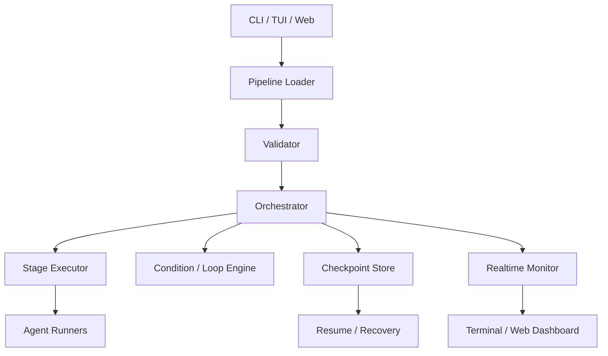
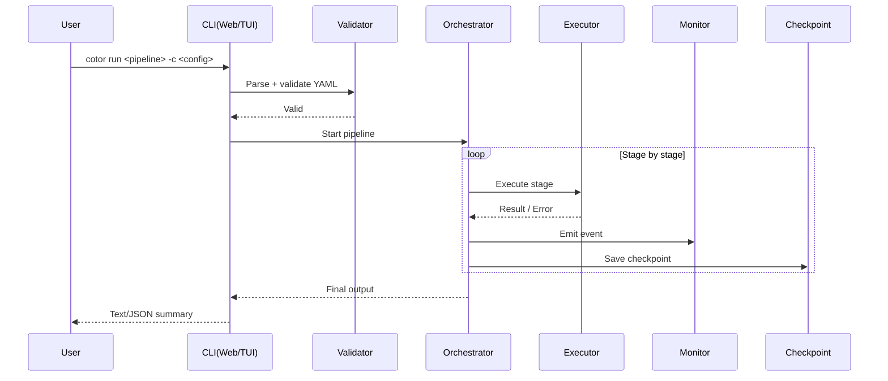

# Cotor Architecture

Cotor는 **설정 기반 파이프라인 오케스트레이터**입니다.
핵심 흐름은 `Config Load → Validate → Orchestrate → Monitor/Checkpoint → Output` 입니다.

## 1) High-level components

## 2) Runtime flow

## 3) Module map (code)

- `src/main/kotlin/com/cotor/domain/` : orchestrator, executor, condition
- `src/main/kotlin/com/cotor/presentation/` : CLI, web, formatter
- `src/main/kotlin/com/cotor/monitoring/` : runtime events/monitoring
- `src/main/kotlin/com/cotor/checkpoint/` : checkpoint persistence/resume
- `src/main/kotlin/com/cotor/validation/` : pipeline/config validation

## 4) Why this structure

- **Separation of concerns**: parsing/검증/실행/표시를 분리해 변경 영향 최소화
- **Resilience**: checkpoint + resume로 중단 후 복구 가능
- **Observability**: 모니터 이벤트를 통해 CLI/TUI/Web에서 동일한 실행 상태 표시

---

관련 문서:
- [Quick Start](QUICK_START.md)
- [Features](FEATURES.md)
- [Web Editor](WEB_EDITOR.md)
- [Usage Tips](USAGE_TIPS.md)
